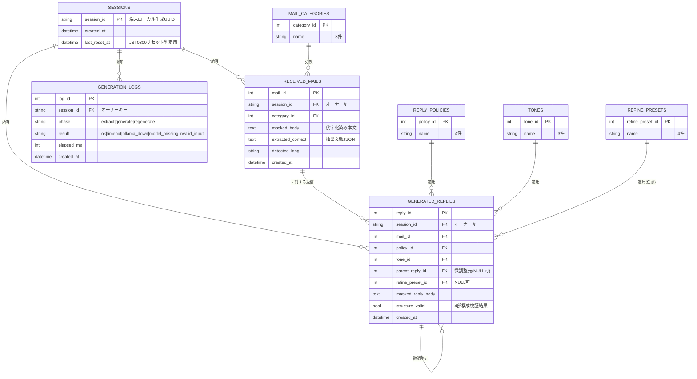
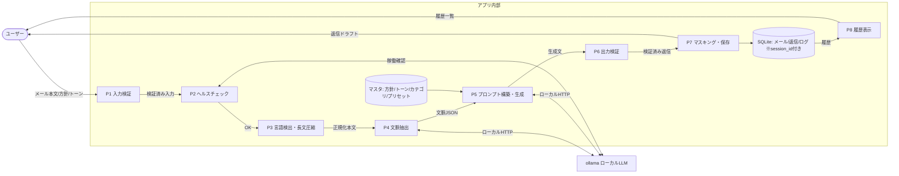
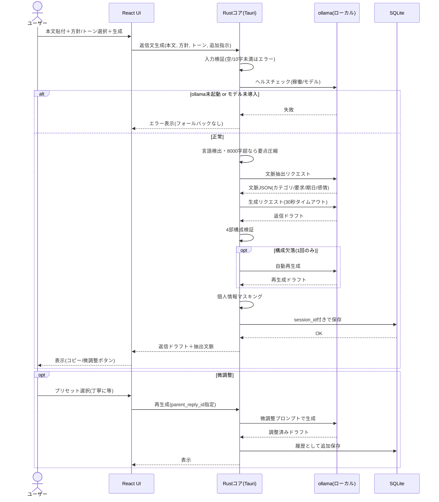
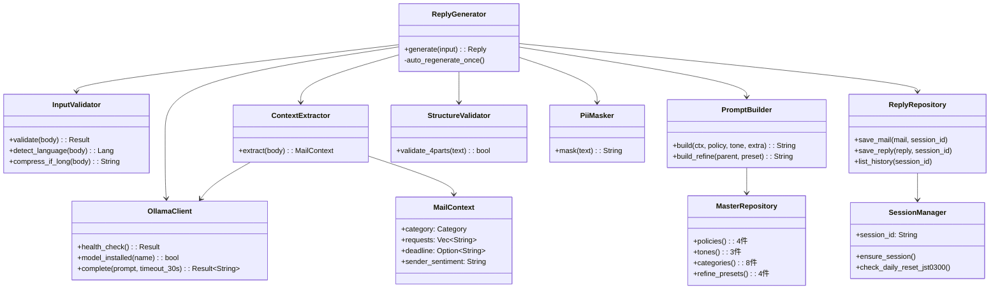
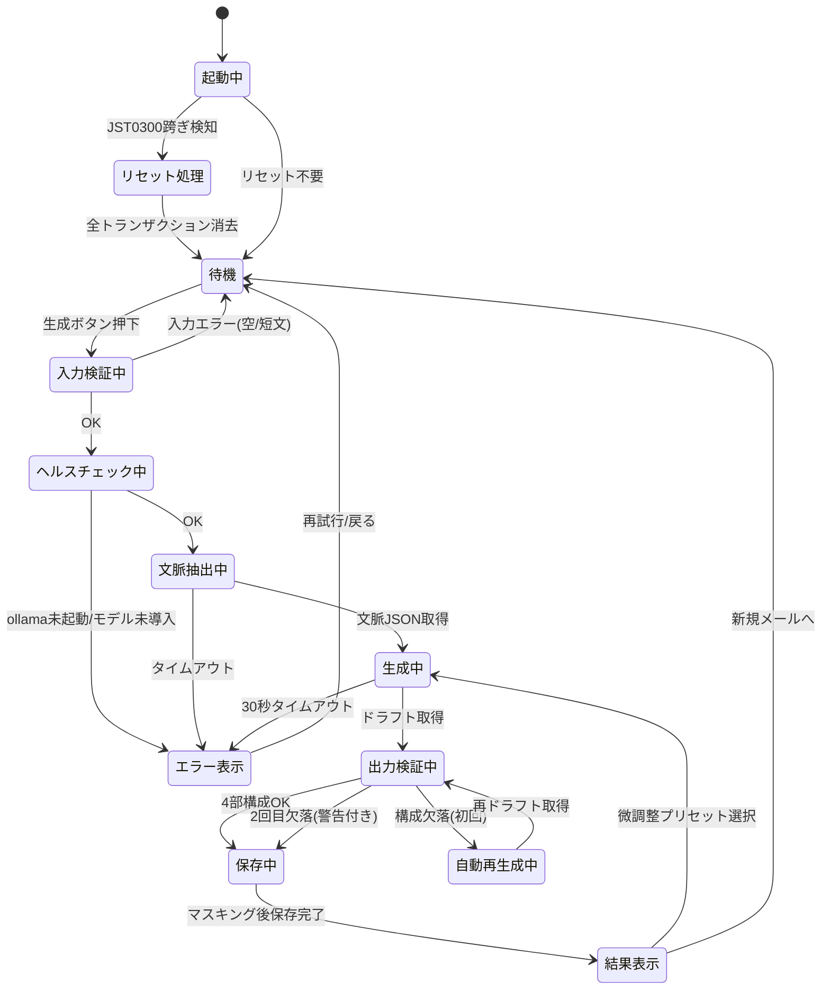
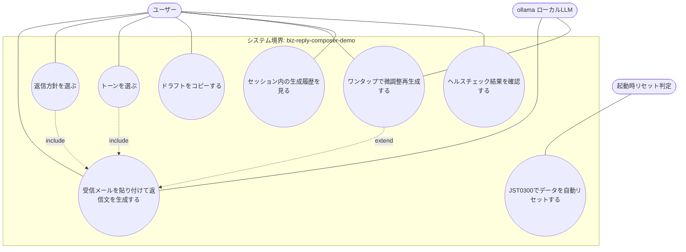

# biz-reply-composer-demo 設計資料

**課題：** 文脈に合わせて返信文を作るビジネスメールAI
**対象エディション：** デモ版（ショーケース）
**プラットフォーム：** デスクトップ（Rust + Tauri / React + TypeScript / SQLite / ollama）

> 本書はデモ版のみを設計対象とする。他エディションの設計・比較は含まない。

---

## 1. 仕様書

### 1.1 目的

受信したビジネスメールの本文を貼り付けると、文脈（用件・要求事項・期日・相手のトーン）を解析し、ユーザーが選んだ返信方針とトーンに沿った返信文ドラフトを生成するデスクトップアプリ。技術・UXを体験させる展示物として、外部API・APIキー・認証を一切使わずに動作する。

### 1.2 選定理由（プラットフォーム）

- 返信文生成はルールベースでは文脈追従が困難であり、ローカルLLMが必要。
- デモ版制約により外部APIは禁止のため、ネットワーク通信なし・APIキー不要のollama（ローカルLLM）が使えるデスクトップを選定。
- バックエンドロジックはRust、UIはReact（TypeScript）、DBはSQLiteのみ。

### 1.3 推奨モデル

- 既定：Gemma 3 4B（Google製。軽量帯で日本語ビジネス文の品質と動作要件のバランスが良い）
- 高品質代替：Llama-3-ELYZA-JP-8B（日本ELYZA製・Metaベース。日本語特化。メモリ8GB以上の環境向け）
- 軽量代替：Phi-4 mini（Microsoft製。低スペック環境向けフォールバック候補）
- **中国製モデル（Qwen等）は採用しない方針とする。**
- モデルのダウンロードはユーザーが事前に済ませていることを前提とし、アプリ内でのモデルダウンロードは行わない。
- ollamaが未起動・モデル未導入の場合はエラーとして処理し、フォールバックしない。

### 1.4 機能一覧

| # | 機能 | 概要 |
|---|---|---|
| F1 | 受信メール入力 | 本文をテキスト貼り付け（10〜8,000字。超過時は要点圧縮の前処理） |
| F2 | 文脈解析 | 用件カテゴリ・要求事項・期日・相手の感情トーンをLLMで構造化抽出 |
| F3 | 返信方針選択 | 承諾／辞退／保留／追加質問 の4択 |
| F4 | トーン選択 | フォーマル／標準／カジュアル の3択 |
| F5 | 返信文生成 | 4部構成（宛名→挨拶→本文→結び）を強制。宛名・署名は `{{相手名}}` `{{自分の署名}}` トークン固定で固有名詞捏造を禁止 |
| F6 | 出力検証 | 4部構成の充足を検査。欠落時は1回だけ自動再生成 |
| F7 | ワンタップ再生成 | 「もっと丁寧に」「短く」「柔らかく」等の微調整再生成 |
| F8 | 履歴表示 | 同一セッション内の生成履歴の閲覧・コピー |
| F9 | ヘルスチェック | 起動時・生成直前にollama稼働とモデル導入を確認 |
| F10 | 自動リセット | JST 03:00 を跨いだ最初の起動時にトランザクションデータを全消去 |

### 1.5 中核関数（自然言語ロジック・最終版 v3）

**関数名：** `返信文生成(受信メール本文, 返信方針, トーン, 追加指示)`

1. 入力検証：本文が空、または10文字未満ならエラーを返して終了する。
2. ヘルスチェック：ollamaの稼働と推奨モデルの導入を確認する。不合格なら明示的なエラーを返し、フォールバックしない。
3. 言語検出：本文の言語を判定する。返信は同一言語で生成する（ユーザーが言語を明示指定した場合はそちらを優先）。
4. 長文圧縮：本文が8,000字を超える場合、先に要点抽出を行い圧縮した要約を後続の入力とする。
5. 文脈抽出：LLMに「用件カテゴリ（8分類）・要求事項・期日・相手の感情トーン」をJSON構造で抽出させる。
6. プロンプト構築：抽出文脈＋返信方針＋トーン＋追加指示を、日本語ビジネスメールの4部構成を強制し固有名詞の捏造を禁止するシステムプロンプトへ注入する。
7. 生成：ollamaへリクエストする。30秒でタイムアウトし、エラーと再試行ボタンを提示する。
8. 出力検証：宛名・挨拶・本文・結びの4部の存在を検査する。欠落があれば1回だけ自動再生成し、再度欠落なら警告付きで表示する。
9. マスキング保存：氏名らしき文字列・メールアドレス・電話番号を伏字化してから、セッションIDをオーナーキーとしてSQLiteへ保存する。
10. 表示：生成結果・抽出文脈・コピー用ボタン・微調整ボタンを返す。

### 1.6 テスト設計と結果

- 組み合わせテスト：代表メール5種（依頼・催促・謝罪・日程調整・クレーム）× 返信方針4 × トーン3 ＝ 60ケース → 全合格
- 異常系8ケース：空入力／10文字未満／8,000字超／英語入力／ollama未起動／モデル未導入／タイムアウト／個人情報含有入力のマスキング → 全合格
- 課題解決度：約98%（残余はローカルLLM生成の確率的性質によるもの。出力検証＋自動再生成＋手動再生成でカバー）

### 1.7 デモ版制約への適合

| 制約 | 適合内容 |
|---|---|
| 外部API禁止 | ollama（ローカル通信のみ）。APIキー不使用。ネットワーク越し呼び出しなし |
| 認証禁止 | 認証・認可なし。端末ローカルのセッションIDのみ |
| セッション分離 | 全テーブルにsession_idを付与し、セッションをまたぐ参照・操作を禁止 |
| DB | SQLiteのみ。JST 03:00基準で自動リセット |
| 個人情報 | 氏名・メール・電話・住所・生年月日は保存しない。入力に含まれる場合は保存前に伏字化 |
| 実装方式 | 1issueワンショット実装（`claude --dangerously-skip-permissions`） |

### 1.8 マスタデータ件数（デモ版）

| マスタ | 件数 | 内容 |
|---|---|---|
| 返信方針マスタ | **4件** | 承諾／辞退／保留／追加質問 |
| トーンマスタ | **3件** | フォーマル／標準／カジュアル |
| 用件カテゴリマスタ | **8件** | 依頼／催促／謝罪／日程調整／問い合わせ／御礼／クレーム／その他 |
| 微調整プリセットマスタ | **4件** | もっと丁寧に／短く／柔らかく／具体的に |
| 推奨モデルマスタ | **3件** | Gemma 3 4B（既定）／Llama-3-ELYZA-JP-8B／Phi-4 mini ※非中国製のみ |
| **合計** | **22件** | |

> **注記：デモ版では上記の最小単位のマスタデータでしかテストできない。** 実運用規模のカテゴリ体系・多数ユーザー・大量履歴を用いた検証は本エディションの範囲外である。

---

## 2. ER図

---

## 3. DFD（データフロー図）

---

## 4. シーケンス図

---

## 5. クラス図

---

## 6. 状態遷移図

---

## 7. ユースケース図

---

## 8. 補足事項

- **デモ版のデータ規模に関する注記（再掲）：** 本エディションはマスタ合計22件の最小単位データでのみ動作・テストを行う。大規模カテゴリ体系や大量履歴での性能・品質検証はデモ版の範囲外。
- **セッション分離：** すべてのトランザクションテーブル（受信メール・生成返信・ログ）はsession_idをオーナーキーとして持ち、他セッションのデータは参照・操作できない。
- **個人情報：** 氏名・メールアドレス・電話番号・住所・生年月日は設計上保持しない。入力に混入した場合は保存前に伏字化する。宛名・署名は `{{相手名}}` `{{自分の署名}}` トークンで扱い、実名は扱わない。
- **フォールバック禁止：** ollama未起動・モデル未導入・タイムアウトはすべて明示的なエラーとし、ルールベース等への代替生成は行わない。
